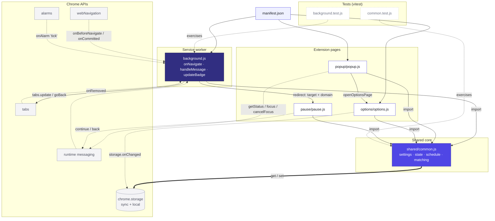

# Architecture

Manifest V3, no server, no analytics, no external requests — everything runs and stays local.

## Module graph

Every page imports `shared/common.js` directly rather than talking to each other; the
service worker (`background.js`) is the only module that touches `chrome.tabs` and
`chrome.webNavigation`.

Legend: solid arrow = ES module import · thick arrow = storage read/write ·
dotted arrow = event listener or `chrome.runtime` message · dashed node border = covered by a test suite.

## Request flow: opening a blocked site

1. **webNavigation fires twice.** `onBeforeNavigate` and `onCommitted` both call the same
   `onNavigate()` in `background.js` — the first alone misses redirect chains like
   `youtu.be → youtube.com`, so the check runs idempotently on both.
2. **The hostname is matched against the blocklist.** `matchSite()` in `shared/common.js`
   strips `www.` and checks the host against `settings.sites`. No match, no pause — the
   request ends here.
3. **`isArmed()` decides if Pause+ is actually watching.** A live focus boost overrides
   everything; otherwise the master toggle and the weekday/weekend `schedule` both have
   to agree the extension is on.
4. **The tab is redirected to the pause screen.** `background.js` swaps the tab's URL for
   `pause/pause.html`, carrying the original `target` and matched `domain` as query params.
5. **`pause.js` waits out `pauseSeconds`, then reveals two doors.** *Continue* sends
   `{ type: 'continue' }` to the service worker, which grants a one-tab allowance and
   navigates there directly. *Back* just calls `chrome.tabs.goBack()` — no message to the
   blocked domain either way.

## File reference

| Layer | File | Role | Lines |
| --- | --- | --- | ---: |
| Config | `manifest.json` | MV3 manifest — wires the service worker, popup, and options page together. | 27 |
| Core | `shared/common.js` | Settings/state persistence, schedule math, domain matching, focus-boost logic. Imported by every other module; the only file with no `chrome.*` side effects besides storage. | 151 |
| Worker | `background.js` | The service worker: navigation interception, message handling, badge updates, a write queue that serializes concurrent state mutations. | 182 |
| Page | `popup/popup.js` | Master toggle and focus-boost controls; polls `getStatus` every 30s while open. | 84 |
| Page | `options/options.js` | Schedule editor and site blocklist manager; re-syncs live if settings change in another tab. | 146 |
| Page | `pause/pause.js` | The interstitial itself — timed reveal, optional "state your intent" gate, continue/back actions. | 61 |
| Test | `tests/common.test.js` | Vitest coverage for schedule math, domain matching, and allowance helpers. | 259 |
| Test | `tests/background.test.js` | Vitest coverage for `onNavigate`, `handleMessage`, and the service-worker event wiring. | 266 |
| Tooling | `tools/make_icons.py` | One-off Python script that generates the icon set — not part of the runtime graph. | 67 |

## Storage model

- **Settings** live in `chrome.storage.sync` (roam with your profile); **volatile state**
  (focus boost expiry, per-tab passes) in `chrome.storage.local`.
- Interception uses `webNavigation.onBeforeNavigate` → redirect to the internal pause
  page, because the armed/not-armed decision depends on schedule and focus state that
  static blocking rules can't express.
- Passes are keyed by tab **and** domain, so a pass covers one site in one tab —
  reopened or new tabs naturally re-trigger the pause.
